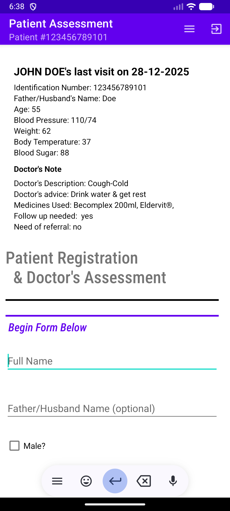
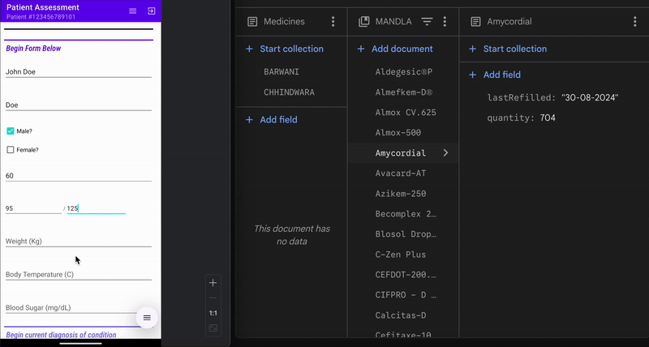
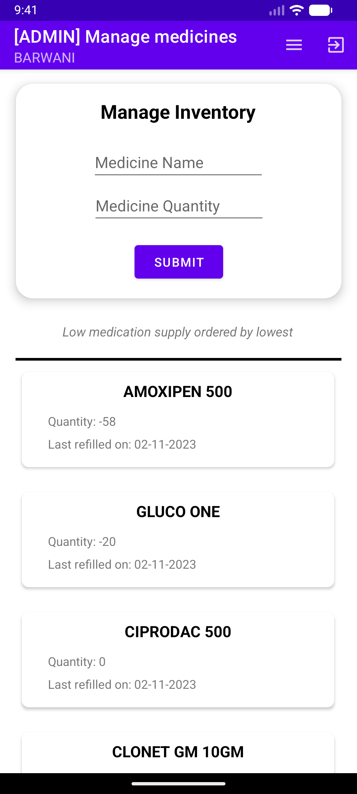
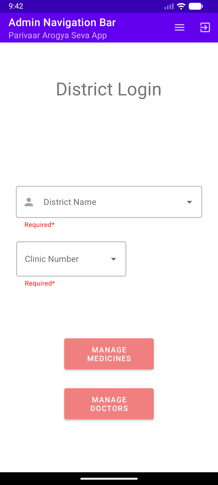
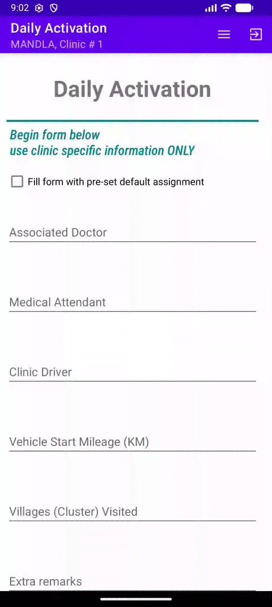

# Humanitarian Medical Informatics System
### A “MyChart”-style patient record + operations platform for mobile clinics (India & South Sudan)

## 📌 Project Overview
This platform is the digital backbone for humanitarian organizations (Parivaar, Samaritain Help Mission, SuDRO Sudan) running mobile hospitals. It replaces paper-based workflows (tally marks and handwritten logs) with a searchable, longitudinal medical record and an administrative control layer for clinic operations.

Like Epic/MyChart’s patient record concept—adapted for field constraints—this system provides:
- a **Clinician Portal** for visit documentation and historical context
- an **Admin Portal** for inventory, staffing, and multi-district management

**Scale:** 500,000+ patient records/year across 17+ districts  
**Design Constraints:** intermittent connectivity (“dead zones”), variable device quality, and uneven digital literacy among staff

---

## 📱 Interactive Product Showcase

### 1. Clinical History Retrieval & Visit Timeline
The system retrieves a patient’s longitudinal record via a unique Aadhaar ID. Clinicians can instantly view prior visits and trends (e.g., weight, blood pressure, blood sugar), supporting continuity of care across rotating mobile clinics.

| Interactive ID Search & History Retrieval | Clinical Assessment Entry |
| :---: | :---: |
|  |  |
| **Fast Lookup:** Instant query over a NoSQL longitudinal record. | **Visit Timeline:** Demo patient (John Doe) showing historical trends. |

---

### 2. Real-Time Medication Logic & Cloud Sync
This section demonstrates the core automation layer. As clinicians enter vitals and prescriptions, backend logic performs calculations and synchronizes updates to the cloud database.

| Real-Time Database Synchronization |
| :---: |
|  |
| **Split-Screen Proof:** Firebase (right) updates medicine quantities (e.g., *Amycordial*) immediately as the assessment form (left) is processed. |

---

### 3. Administrative & Supply Chain Visibility
The administrative side models the “economics” of humanitarian aid: inventory visibility, district-wide coordination, and operational control for mobile clinic deployments.

| Smart Inventory Management | Admin Navigation & Control |
| :---: | :---: |
|  |  |
| **Inventory Tracking:** Real-time stock levels for critical medicines. | **Admin Portal:** Centralized navigation across districts and clinics. |

---

### 4. Daily Clinic Activation & Staff Assignment (Mobile Ambulances)
Mobile clinics require reliable attribution: who staffed the clinic, which vehicle was used, and which cluster of villages was served. This module creates a single “clinic session” that binds staff + vehicle metadata, and becomes the default context for all visits recorded that day.

| Daily Clinic Activation & Staff Assignment |
| :---: |
|  |
| **Operational Orchestration:** Doctor/attendant/driver assignments + vehicle mileage + village cluster are persisted as one session object so downstream patient visits inherit the correct staff and logistics metadata. |

---

## 🚀 Key Technical Innovations
- **Clinic Session Orchestration:** Daily activation workflow binds doctors, support staff, drivers, vehicles, and geographic clusters into a single persistent session. Patient visits automatically associate with this session for consistent attribution and auditability.
- **Automated Workflow Logic:** Java-based automation that handles staff clock-ins and location assignments based on the first and last patient interactions of the day.
- **Smart Inventory Intelligence:** Stock levels for medicines (e.g., Cipro-500, Amoxipen) deduct in real time as treatments are recorded, triggering low-stock flags for administrators.
- **Offline-First Persistence Model:** Data is stored locally and queued for sync; it automatically reconciles with **Firebase Cloud Firestore** once the clinic returns to reliable 3G/4G coverage.
- **Administrative Analytics Export:** Custom transformation layer exports nested NoSQL structures into organized Google Sheets for high-level analysis.

---

## 🛠️ Technical Stack
- **Frontend:** Android Studio (Java)
- **Backend & Database:** Firebase Cloud Firestore
- **Deployments:** Rural India (Parivaar), South Sudan (SuDRO)

<b>📖 Read the Project Backstory (The "Why")</b>

When I first started working with Parivaar, most medical history lived in paper logs—hard to search, easy to lose, and impossible to aggregate across clinic visits. I built this system to make continuity of care feasible in mobile settings: durable longitudinal records, operational accountability, and a workflow that still functions when the network doesn’t.

